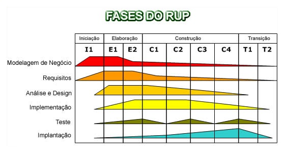
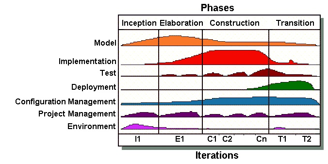

## AUP e RUP

---
### Etapas
#### RUP (Rational Unified Process)

|etapas|AUP|
|-|-|
|Modelagem de negócios| Compreender o negócio em si (a comunicação entre engenharia de negócios e engenharia de software) os problemas e as possíveis melhorias|
|Requisitos|Levantar os pedidos das partes interessadas e transforma-los em requisitos detalhados que descrevem o sistema|
|Análise e Design|Estruturação do projeto (componentes, classes, ...)|
|Implementação|Utilização de componentes existentes ou criação de novos|
|Teste|Verificar a interação entre as partes do sistema garantindo que não hajam defeitos|
|Implantação|A entrega do software aos usuários finais, cobrindo as atividades de releases externos, embalagem, distribuição, instalação, assistência, ...|

---
#### AUP (Agile Unified Process)

|etapas|AUP|
|-|-|
|Modelo|Domínio do problema e identificação das possíveis soluções|
|Implementação| Modelo básico para testes|
|Teste|Avaliação de qualidade para verificar se os requisitos foram atendidos|
|Implantação|Planejamento da entrega do sistema|
|Gerenciamento de configuração|Gerenciar as alterações feitas no projetos|
|Gerenciamento de projetos|Direcionar as atividades, para garantir o prazo e orçamento corretos|
|Meio Ambiente|Disponibilidade das normas, diretrizes, ferramentas, equipamento,... a equipe|

##### Comparativo
|| AUP | RUP |
|-|-|-|
|1|Modelo|Modelagem de negócios|
|2|Implementação|Requisitos|
|3|Teste|Análise e Design|
|4|Implantação|Implementação|
|5|Gerenciamento de configuração|Teste|
|6|Gerenciamento de projetos|Implantação|
|7|Meio Ambiente| * |

> Nota: Na AUP as etapas de [IMPLEMENTAÇÃO, TESTE e IMPLANTAÇÃO] ocorrem partindo da segunda etapa, já na RUP estas são as três últimas etapas, sendo assim, RUP é uma metodologia mais estática (sequêncial), ou seja, imutável já que a documentação precede o sistema, não havendo muitas alterações nas etapas finais.

---
